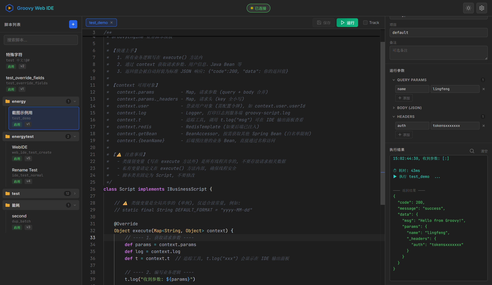
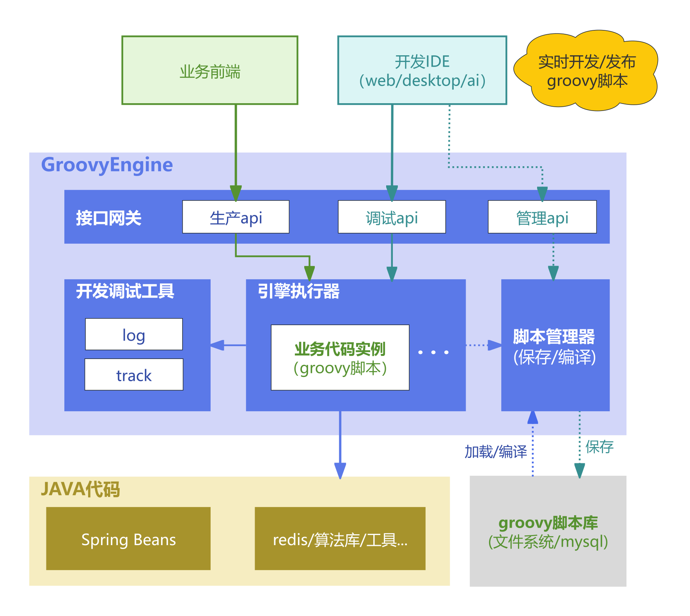

<div align="center">


# Groovy Web IDE

**基于 Monaco Editor 的 Groovy 动态脚本在线管理与调试工具**，需结合GroovyEngine框架（另开源项目）使用

[](https://vitejs.dev/)
[](https://microsoft.github.io/monaco-editor/)
[](LICENSE)

轻量、零依赖的浏览器端 IDE，连接 GroovyEngine 后端即可进行脚本的在线开发、测试和部署管理。

[功能特性](#-功能特性) · [快速开始](#-快速开始) · [架构概览](#-架构概览) · [API 接口](#-api-接口) · [部署指南](#-部署指南)

</div>

---

## 📸 界面预览



## ✨ 功能特性

### 🎯 核心功能

- **Monaco 代码编辑器** — 完整的 VS Code 编辑体验，支持 Groovy 语法高亮、括号匹配、多光标编辑
- **智能代码补全** — 自动从后端加载已注入的 Java Bean 方法签名，提供 ctx 上下文补全
- **脚本 CRUD** — 新建、编辑、保存、删除脚本，支持字段修改检测与脏状态提醒
- **在线测试运行** — 配置 Query Params / Body (JSON) / Headers，一键运行并查看格式化结果
- **Track 追踪模式** — 开启后可追踪脚本执行期间所有 Java Bean 调用链，包含方法名、参数、返回值和耗时
- **多标签页编辑** — 同时打开多个脚本，支持标签切换、关闭确认、滚动导航
- **脚本分类管理** — 按 category 自动分组折叠，支持实时搜索过滤

### 🎨 界面设计

- **深色 / 浅色主题** — 一键切换，自动同步 Monaco 编辑器主题
- **三栏布局** — 脚本列表 | 代码编辑器 | 信息面板，清晰的工作区划分
- **JetBrains Mono 字体** — 专业代码编辑字体
- **状态指示** — 连接状态实时显示，启用/禁用/版本号直观标注

### 🔒 安全机制

- **API Key 鉴权** — 所有请求通过 `X-Groovy-Token` 头验证身份
- **登录令牌透传** — 可选配置 `Authorization` 令牌，测试执行时获取真实用户上下文

## 🚀 快速开始

### 环境要求

- Node.js 18+
- GroovyEngine 后端服务（[了解后端引擎](#-架构概览)）

### 安装运行

```bash
# 克隆项目
git clone https://github.com/fengin/groovy-web-ide.git
cd groovy-web-ide

# 安装依赖
npm install

# 启动开发服务器
npm run dev
```

浏览器自动打开 `http://localhost:5173`，点击右上角 ⚙️ 设置按钮配置后端连接。

### 连接配置

| 配置项         | 说明                         | 示例                          |
| ----------- | -------------------------- | --------------------------- |
| **后端地址**    | GroovyEngine 所在的服务器地址      | `http://192.168.1.100:8025` |
| **API Key** | 后端配置的 `groovy.api.token` 值 | `your-secret-key`           |
| **登录令牌**    | 可选，用于测试执行时传递用户身份           | `Bearer eyJhbGciOi...`      |

### 构建部署

```bash
# 构建生产版本
npm run build

# 预览构建结果
npm run preview
```

构建产物在 `dist/` 目录，可部署到任意静态文件服务器（Nginx、CDN 等）。

## 🏗 架构概览

Groovy Web IDE 是 **GroovyEngine 动态业务执行引擎** 的开发工具前端，整体架构如下：



### IDE 在架构中的位置

```
                    ┌───────────────────────┐
                    │   Groovy Web IDE      │  ◄── 本项目
                    │   (浏览器)             │
                    └──────────┬────────────┘
                               │ HTTP (Vite Proxy / 直连)
                               ▼
                    ┌───────────────────────┐
                    │   GroovyEngine 后端    │
                    │   管理 API + 调试 API   │
                    │   脚本管理器 + 执行引擎  │
                    └──────────┬────────────┘
                               │
                    ┌──────────┴────────────┐
                    │  MySQL / 脚本存储       │
                    │  Spring Beans          │
                    └───────────────────────┘
```

### 技术栈

| 层面        | 技术                     | 说明              |
| --------- | ---------------------- | --------------- |
| **构建工具**  | Vite 8.x               | 极速 HMR 开发体验     |
| **代码编辑器** | Monaco Editor 0.55     | VS Code 同款编辑器内核 |
| **前端框架**  | Vanilla JS             | 零框架依赖，轻量高效      |
| **样式方案**  | Vanilla CSS            | CSS 变量驱动的主题系统   |
| **字体**    | JetBrains Mono + Inter | 代码字体 + UI 字体    |

### CORS 跨域处理

| 场景           | 方案         | 请求链路                                   |
| ------------ | ---------- | -------------------------------------- |
| **开发模式**     | Vite 代理    | 浏览器 → localhost:5173 → Vite proxy → 后端 |
| **生产部署（同域）** | 无需处理       | 浏览器 → 同域后端                             |
| **生产部署（跨域）** | 后端 CORS 配置 | 浏览器 → 跨域后端（需配置 CORS）                   |

> 💡 开发模式下，`vite.config.js` 已配置 `/api/groovy` 路径代理到 `http://localhost:8025`，可按需修改目标地址。

## 📡 API 接口

IDE 通过 RESTful API 与 GroovyEngine 后端交互：

| 接口   | 方法     | 路径                                    | 说明                         |
| ---- | ------ | ------------------------------------- | -------------------------- |
| 脚本列表 | GET    | `/api/groovy/script/list`             | 支持 category/projectCode 筛选 |
| 脚本详情 | GET    | `/api/groovy/script/:id`              | 获取脚本完整信息                   |
| 创建脚本 | POST   | `/api/groovy/script`                  | 新建脚本                       |
| 更新脚本 | PUT    | `/api/groovy/script/:id`              | 保存修改                       |
| 删除脚本 | DELETE | `/api/groovy/script/:id`              | 删除脚本                       |
| 测试执行 | POST   | `/api/groovy/script/test`             | 测试运行（支持 track 模式）          |
| 代码补全 | GET    | `/api/groovy/script/completions`      | 获取 Bean 方法签名               |
| 刷新缓存 | POST   | `/api/groovy/script/refresh/:bizCode` | 刷新单个脚本缓存                   |
| 全量刷新 | POST   | `/api/groovy/script/refresh/all`      | 重载全部脚本                     |
| 批量部署 | POST   | `/api/groovy/script/deploy`           | 批量导入脚本                     |

所有接口需要携带 `X-Groovy-Token` 请求头进行鉴权。

## 📁 项目结构

```
groovy-web-ide/
├── index.html          # 主页面（三栏布局 + 对话框）
├── src/
│   ├── api.js          # API 封装层（RESTful 请求）
│   ├── main.js         # 核心逻辑（编辑器、标签页、脚本管理）
│   └── style.css       # 完整样式系统（深色/浅色主题）
├── docs/
│   ├── architecture.png  # GroovyEngine 整体架构图
│   └── screenshot.png    # 界面截图
├── vite.config.js      # Vite 配置（代理、端口）
└── package.json        # 依赖管理
```

## 📦 部署指南

### 方式一：Nginx 静态部署

```nginx
server {
    listen 80;
    server_name groovy-ide.example.com;

    root /var/www/groovy-web-ide/dist;
    index index.html;

    # SPA 路由回退
    location / {
        try_files $uri $uri/ /index.html;
    }

    # API 代理到 GroovyEngine 后端
    location /api/groovy/ {
        proxy_pass http://backend-server:8025;
        proxy_set_header Host $host;
        proxy_set_header X-Real-IP $remote_addr;
    }
}
```

### 方式二：嵌入后端项目

将 `dist/` 目录下的构建产物拷贝到 Spring Boot 项目的 `src/main/resources/static/ide/` 目录，通过后端服务直接提供，无跨域问题。

## 🤝 相关项目

- **[Groovy Desktop IDE](https://github.com/fengin/groovy-desktop-ide)** — 跨平台桌面版（基于 Tauri 2.0 + Rust），与本项目功能一致，无须部署，直接可用
- **GroovyEngine** — 后端 Groovy 动态业务执行引擎，提供脚本编译、缓存、执行和管理能力

## 📄 License

[MIT](LICENSE)

---

<div align="center">

**Made with ❤️ by [凌封](https://aibook.ren)**

技术交流圈：[https://aibook.ren](https://aibook.ren)（AI全书）

</div>
